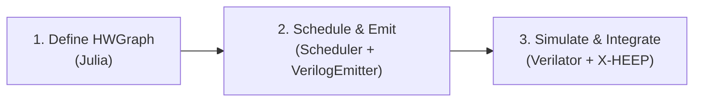

# HWExplore, A Hardware Acceleration Framework
[](https://julialang.org/)
[](https://ieeexplore.ieee.org/document/8299595)
[](https://riscv.org/)
[](https://opensource.org/licenses/MIT)


**HWExplore** is an open-source hardware acceleration framework for RISC-V. It lets you describe a computation once, as a dataflow graph in Julia, or as a call into a library of hand-optimized IP blocks, and turns it into a pipelined, [CV-X-IF](https://docs.openhwgroup.org/projects/openhw-group-core-v-xif/)-compliant coprocessor that plugs straight into the [X-HEEP](https://github.com/esl-epfl/x-heep) RISC-V microcontroller, with the routing logic to dispatch between multiple accelerators auto-generated for you.

You define your math. HWExplore takes that and moves it to either

- a general dataflow-graph-to-RTL compiler (schedule it, pipeline it, emit it) or
- a curated library of hand-crafted, expert-tuned datapaths (SIMD, modular arithmetic, memory-backed algorithms)

...all routed through the *same* auto-generated dispatcher, so both kinds of accelerator look identical to the CPU issuing instructions.

Writing a RISC-V coprocessor by hand today means: hand scheduling your pipeline stages, hand-wiring the mux if you want more than one custom instruction, and redoing all of it for the next algorithm.



## What it delivers today

This section is a snapshot of what's actually implemented and verified, not the vision. See [Roadmap](#roadmap) for where it's going.

**The compiler core**
- A dataflow-graph IR (`HWGraph` / `DFGNode`) with 12 opcodes: arithmetic (`ADD`, `SUB`, `MUL`), bitwise (`SHR`, `SHL`, `AND`, `OR`, `XOR`), `MOD`, a conditional `MUX` (ternary select), plus `ARG`/`CONST`/`RET` and an escape hatch (`OP_PRIMITIVE`) for opting a node out of auto-scheduling entirely.
- A **multi-cycle-aware ASAP scheduler** that takes opcode latencies (`MUL` > `ADD`) and chains dependent operations correctly via topological sort + finish-cycle tracking, rather than assuming everything is single-cycle.
- A **Verilog emitter** that turns a scheduled graph into a correctly-pipelined SystemVerilog module: automatic pipeline register insertion, per-node combinational/registered wire resolution, and a `done_o` shift register matching the graph's true pipeline depth, with the standardized `clk_i / rst_ni / start_i / rs1_i / rs2_i / rd_o / done_o` contract every datapath in the system shares.

**The primitive library**
- A registry (`PrimitiveLibrary`) mapping names to hand-written SystemVerilog modules with declared latency and parameters, such as:
  - `hwx_simd_mac`: 4-lane 8-bit SIMD multiply-accumulate with adder-tree reduction.
  - `hwx_saturating_add`: saturating addition for fixed-point arithmetic.
  - `hwx_barrett_reduction`: for NTT and other modular arithmetic.
  - `hwx_scratchpad`: dual-port scratchpad SRAM for accelerators that need local, address-indexed state beyond what two 32-bit operands can carry, the foundation for array/vector algorithms like NTT.

**The dispatch layer, the part that makes this a *framework* and not four one-off accelerators**
- A build manifest (`scripts/build_manifest.jl`) listing every datapath in the system by name, `funct3` ID, and latency.
- `DispatcherEmitter.jl` turns that manifest into `hwx_mux.sv`.

**The CV-X-IF integration**
- `cvxif_hwx_shell.sv`: a hand-written 4-state FSM (`IDLE → WAIT_COMMIT → WAIT_DATAPATH → SEND_RESULT`) implementing the CV-X-IF issue/commit/result handshake, independently Verilator-tested and passing.
- `hwx_top.sv` wires the shell, mux, and X-HEEP's `if_xif` interface, verified full-system in Verilator (all four stateless funct3 datapaths, real cv32e40px CPU, real cross-compiled firmware, `EXIT SUCCESS`).

**The Software**
- A Julia-function to LLVM-IR path via `GPUCompiler.jl` exists (`src/Frontend/`), with loop-unrolling annotation support (`@nexus_unroll`). The IR → `HWGraph` translation layer lives in `src/Frontend/IRTranslator.jl` and is under active development.

## How to use it

### Adding a new auto-generated datapath

```julia
using .DFG_Builder

graph = HWGraph("my_accel", Dict(
    1 => DFGNode(1, OP_ARG,   32, [],    nothing, 0, 0, nothing, Dict()),
    2 => DFGNode(2, OP_ARG,   32, [],    nothing, 0, 0, nothing, Dict()),
    3 => DFGNode(3, OP_MUL,   32, [1,2], nothing, 0, 0, nothing, Dict()),
    4 => DFGNode(4, OP_RET,   32, [3],   nothing, 0, 0, nothing, Dict()),
), [1, 2], [4])

schedule_asap!(graph)
emit_verilog(graph, "hw/rtl/generated/my_accel.sv")
```

### Adding a hand-optimized primitive

Write the SystemVerilog module under `hw/rtl/primitives/` following the standard `clk_i/rst_ni/start_i/rs1_i/rs2_i/rd_o/done_o` contract, then register it once:

```julia
register_primitive!(PrimitiveSpec(
    :my_primitive, "hwx_my_primitive",
    "primitives/hwx_my_primitive.sv",
    3,                                  # latency in cycles
    Dict(:SOME_PARAM => 4)
))
```

### Wiring either one into the CPU

Add a line to `scripts/build_manifest.jl` and rerun it, `hwx_mux.sv` regenerates automatically with your datapath live behind the dispatcher:

```julia
DatapathEntry("my_accel", 4, 2, false, "generated/my_accel.sv"),   # funct3 = 4
```

```bash
julia --project=. scripts/build_manifest.jl
```

### Simulating

```bash
verilator --cc hw/rtl/generated/my_accel.sv --exe hw/tb_veril/tb_generated.cpp --top-module my_accel
make -C obj_dir -f Vmy_accel.mk Vmy_accel
./obj_dir/Vmy_accel
```

See [`docs/Usage_and_Examples.md`](docs/Usage_and_Examples.md) for the full walkthrough, including shell-level and waveform-based debugging.

## Project status

| Component | Status | Notes |
|---|---|---|
| DFG data model | Working | 12 opcodes incl. `OP_MUX`, `OP_PRIMITIVE` |
| Multi-cycle ASAP scheduler | Working | Real per-opcode latency, correct pipeline-depth tracking |
| Verilog emitter | Working | Auto pipeline registers, `done_o` shift register |
| Primitive registry | Working | 4 primitives registered (`simd_mac`, `saturating_add`, `barrett_reduction`, `mont_adapter`) |
| Dispatcher generator | Working | `hwx_mux.sv` auto-generated from manifest |
| CV-X-IF shell | Working | Verilator-verified standalone |
| Scratchpad SRAM | Early draft | Module exists; needs a syntax pass and DMA/mem-channel wiring |
| Barrett reduction primitive | Early draft | Combinational only, needs pipelining and registry entry |
| `hwx_top.sv` / X-HEEP integration | Working | Full-system Verilator sim verified: cv32e40px + CV-X-IF, all 4 stateless datapaths, `EXIT SUCCESS` |
| Montgomery multiplication | Early draft | |
| LLVM IR frontend / `IRTranslator.jl` | Experimental | Codegen path exists; IR→DFG translation in progress |
| Shell-level (multi-instruction) pipelining | Not started | Current shell handles one in-flight instruction at a time |
| PPA / benchmarking harness | Not started | |

### Prerequisites

- Julia 1.9+
- Verilator 5.x
- C++ compiler (`clang++` or `g++`)

## How it's structured

```text
HWExplore/
├── src/                                # Julia: the compiler side
│   ├── HWExplore.jl                    # Module entry point, public API
│   ├── Core/
│   │   ├── DFG_Builder.jl              # Opcode, DFGNode, HWGraph, OP_LATENCY
│   │   └── Macros.jl                   # @synthesize / @nexus_accelerate macros
│   ├── Frontend/                       # Julia function → LLVM IR → DFG
│   │   ├── IRFrontend.jl               # extract_and_translate entry point
│   │   ├── IRTranslator.jl             # SSA IR → HWGraph translation
│   │   └── FPGA_Compiler.jl            # Unroll-hint macros, LLVM passes
│   └── HWGen/                          # DFG → RTL generation
│       ├── PrimitiveLibrary.jl         # IP registry
│       ├── Scheduler.jl                # Multi-cycle ASAP scheduling
│       ├── ResourceAllocator.jl        # Resource-constrained list scheduling
│       ├── FSMAnalysis.jl              # Loop/liveness analysis for the FSM backend
│       ├── VerilogEmitter.jl           # HWGraph → pipelined SystemVerilog
│       └── DispatcherEmitter.jl        # Manifest → hwx_mux.sv
│
├── hw/                                 # Hardware
│   ├── rtl/
│   │   ├── hwx_top.sv                  # Top-level: X-HEEP + shell + mux
│   │   ├── cvxif_hwx_shell.sv          # CV-X-IF protocol FSM
│   │   ├── hwx_mux.sv                  # AUTO-GENERATED dispatcher, do not hand-edit
│   │   ├── hwx_scratchpad.sv           # Dual-port scratchpad SRAM
│   │   ├── generated/                  # AUTO-GENERATED example datapaths, do not hand-edit
│   │   │   ├── mac_plus_5.sv
│   │   │   ├── crc_step.sv             # mixed-opcode datapath
│   │   │   └── horner_poly.sv          # deep-pipeline datapath
│   │   └── primitives/                 # Hand-written IP blocks
│   │       ├── hwx_simd_mac.sv
│   │       ├── hwx_saturating_add.sv
│   │       ├── hwx_mont_adapter.sv
│   │       └── hwx_barrett_reduction.sv   # in progress
│   ├── ext_xheep/                      # X-HEEP (git submodule)
│   └── tb_veril/                       # Generic per-primitive Verilator unit testbenches
│
├── scripts/
│   ├── build_manifest.jl               # Edit this to add/remove datapaths, then run it
│   └── test_pipeline.sh                # SW build → HW unit tests → full-system build & run
│
├── examples/
│   └── example.jl                      # Minimal HWGraph walkthrough
│
├── tests/
│   ├── test_dfg.jl                     # End-to-end: graph → schedule → emit → verify
│   ├── test_graphs_tier1.jl            # Deeper/mixed-opcode scheduler stress tests
│   └── test_macrona.jl
│
├── sw/
│   └── platforms/
│       └── xheep/                      # Everything X-HEEP-specific (only platform today;
│           ├── common/                 #   sw/platforms/<name>/ leaves room for more)
│           │   ├── link.ld
│           │   ├── start.S
│           │   └── rules.mk            # Shared cross-compile rules (PATH-based toolchain)
│           ├── tests/                  # Bare-metal C test programs (smoke_test, minimal, test_mac)
│           └── sim/                    # Full-system Verilator co-simulation harness
│               ├── build_hwx_sim.sh
│               ├── gen_vc.py
│               └── tb_hwx_system.sv / .cpp
│
├── draft/                              # Draft/reference docs not meant for the main push
│   ├── Overview.md
│   ├── Architecture_and_Internals.md
│   ├── Research_Roadmap.md
│   ├── Resource_Sharing_and_Macros.md
│   └── DSE_Implementation_Plan.md
│
└── docs/
    ├── Usage_and_Examples.md           # Step-by-step: Julia graph → RTL → simulation
    ├── Baremetal_and_System_Simulation.md  # Full system compilation, testing, X-HEEP integration
    └── XHEEP_Integration.md            # Current X-HEEP-specific integration reference
```

## Roadmap

HWExplore's long-term goal is to stop being "a generator for one X-HEEP SoC" and become a genuinely reusable **open-source hardware acceleration framework**; that's the goal, at least; I'm not sure yet if it's achievable with the resources and time I have. A place where both auto-scheduled dataflow and hand-optimized IP are first-class, addressable from a single Julia-side API, with real benchmark numbers behind every claim.

The concrete research direction that goal is narrowing into: synthesis-verified design-space exploration for CV-X-IF custom-instruction coprocessors, benchmarked against the hand-optimized primitives already in this repo. See [`draft/Research_Roadmap.md`](draft/Research_Roadmap.md) for why it's scoped that way and the phased plan; items 4 and 6 below are its first two phases.

For the detailed, step-by-step version of items 3–5 below, including exactly what's missing in the current X-HEEP wiring and what automated resource sharing actually requires in the emitter, not just the scheduler, see [`docs/XHEEP_Integration.md`](docs/XHEEP_Integration.md).

**Done**
- ~~Full-system `hwx_top.sv` simulation on X-HEEP with a real compiled RISC-V ELF, exercising a custom instruction end to end~~: verified `cv32e40px` + CV-X-IF-enabled X-HEEP, real cross-compiled firmware, all 4 stateless `funct3` datapaths, `EXIT SUCCESS`.
- ~~Bare-metal C test suite (`sw/platforms/xheep/tests`), exercising every datapath behind the mux from real RISC-V code~~: `smoke_test`, `minimal`, and `test_mac` all pass.

**Near term: finish what's in flight**
1. Wire `OP_PRIMITIVE` all the way through `VerilogEmitter.jl` → emit real module instantiations (not just latency keeping) for primitive nodes sitting inside a generated graph.
2. Fix and finish the scratchpad SRAM module → connect it to CV-X-IF's currently unused Memory/Memory-Result channels.
3. Finish the Barrett reducer (pipelined, registered, `done_o`-compliant, in the registry).

**Mid term: make it a real accelerator, not a demo**
4. Resource-constrained scheduling: let the scheduler share a limited pool of multipliers/adders across a graph instead of instantiating one per operation, with automatic mux insertion.
5. Shell pipelining: accept a new instruction before the previous one finishes, using CV-X-IF's instruction `id` field for tagging.
6. A PPA benchmarking harness: script Yosys/X-HEEP's existing synthesis flow, extract Fmax/area/LUT numbers automatically, and pair them with `mcycle`-based software vs. hardware cycle count comparisons. First real FPGA bring-up (see `docs/XHEEP_Integration.md`) is a prerequisite for real numbers here.

## Documentation

- [Overview](draft/Overview.md): Start here: what HWExplore does, how to run it, what the output looks like, testing with Verilator, how X-HEEP integration works, and how all of it supports DSE for tightly-coupled architectures.
- [Architecture and Internals](draft/Architecture_and_Internals.md): What HWExplore is, the CV-X-IF shell/mux/scratchpad, the ISA `funct3`/`funct7` dispatch scheme, detailed port-level wiring reference, and multi-cycle scheduling.
- [Usage and Examples](docs/Usage_and_Examples.md): Step-by-step guide: Julia graph to RTL to Verilator simulation.
- [Baremetal and System Simulation](docs/Baremetal_and_System_Simulation.md): Full system compilation, testing, and X-HEEP integration details.
- [X-HEEP Integration](docs/XHEEP_Integration.md): What's actually wired today vs. not, step-by-step build/run/verify instructions, and the roadmap for full X-HEEP connection and automated resource sharing.
- [Research Roadmap](draft/Research_Roadmap.md): The narrowed research direction (synthesis-verified DSE for CV-X-IF custom-instruction coprocessors, benchmarked against hand-optimized primitives), why it's scoped that way, and the phased implementation plan.
- [Resource Sharing and Macros](draft/Resource_Sharing_and_Macros.md): Shared functional units with operand muxing (`emit_verilog(...; share=…)`), and the `@unroll` / `@tree_reduce` / `@hwkernel` / `hw_compile` macros for describing and configuring hardware in plain Julia, with a verified vector-dot-product sweep.
- [DSE Implementation Plan](draft/DSE_Implementation_Plan.md): Task-level plan for resource sharing and PPA benchmarking: the standalone-module-vs-whole-SoC synthesis question resolved, a verified working Yosys+ABC flow with real numbers, and a checkboxed task list.

See also [CONTRIBUTING.md](CONTRIBUTING.md) for the development workflow and [CHANGELOG.md](CHANGELOG.md) for release notes.

## License

Idirene Daris

MIT
