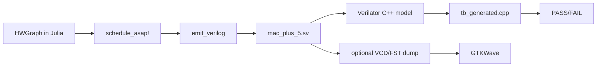

# NexusV Usage and Examples

This guide documents the hardware generation flow: defining a computation in Julia, generating pipelined RTL, and simulating it with Verilator.

## 1. Prerequisites

- Julia 1.9+
- Verilator (5.x recommended)
- C++ compiler (`clang++` or `g++`)
- `make`
- GTKWave (optional, for waveform viewing)

Quick checks:
```bash
julia --version
verilator --version
make --version
```

## 2. Typical Iteration Loop

For each new computation you want to accelerate:

1. Define the dataflow graph nodes in Julia (via macro or `HWGraph` directly)
2. Run the scheduler (`schedule_asap!`)
3. Emit RTL (`emit_verilog`)
4. Build with Verilator
5. Run testbench and check expected result
6. Inspect waveforms if timing/handshake debugging is needed

## 3. Flow Overview



## 4. Step-by-Step Example (`mac_plus_5`)

### Step A: Build and schedule graph in Julia

The sample graph in `tests/test_dfg.jl` or `examples/run_pipeline.jl` computes:

- `node_4 = rs1 * rs2`
- `node_5 = node_4 + 5`
- return `node_5`

Run the end-to-end Julia script (this also emits RTL):

```bash
cd /path/to/NexusV
julia --project=. examples/run_pipeline.jl
```

Expected output includes:
- `[NexusV] Synthesized 'mac_plus_5'`
- `Emitting Verilog to .../hw/rtl/mac_plus_5.sv`

### Step B: Compile generated RTL with Verilator (datapath TB)

Build and link the datapath testbench:

```bash
cd /path/to/NexusV/hw/tb_veril
verilator --cc ../rtl/mac_plus_5.sv \
  --exe tb_generated.cpp \
  --top-module mac_plus_5
make -C obj_dir -f Vmac_plus_5.mk Vmac_plus_5
```

Run simulation:

```bash
./obj_dir/Vmac_plus_5
```

Expected output:
- `done_o asserted`
- `rd_o = 17  (expected 17)`
- `TEST PASSED`

### Step C: Run CV-X-IF shell testbench

For shell-level testing (integration with the CV-X-IF protocol), use a fresh output directory (`--Mdir`) to avoid stale artifacts:

```bash
cd /path/to/NexusV/hw/rtl
verilator --cc cvxif_nexus_shell.sv mac_plus_5.sv \
  --exe tb_cvxif.cpp \
  --top-module cvxif_nexus_shell \
  --Mdir obj_dir_local \
  -I../ext_xheep/hw/vendor/openhwgroup/cv32e40x/rtl/include
make -C obj_dir_local -f Vcvxif_nexus_shell.mk Vcvxif_nexus_shell
./obj_dir_local/Vcvxif_nexus_shell
```

Expected output ends with:
- `Test 1: PASS`
- `Shell back in IDLE after kill: PASS`
- `ALL TESTS PASSED`

## 5. Optional: Waveforms with GTKWave

1. Rebuild with tracing enabled:

```bash
cd /path/to/NexusV/hw/tb_veril
verilator --cc ../rtl/mac_plus_5.sv \
  --exe tb_generated.cpp \
  --top-module mac_plus_5 \
  --trace --Mdir obj_dir_trace
make -C obj_dir_trace -f Vmac_plus_5.mk Vmac_plus_5
```

2. Add VCD dump calls in the testbench (`tb_generated.cpp`) using `VerilatedVcdC`:
- Include `verilated_vcd_c.h`
- Call `Verilated::traceEverOn(true);`
- Call `dut->trace(tfp, 99);`
- Call `tfp->open("wave.vcd");`
- Call `tfp->dump(sim_time);` each half-cycle or cycle
- Close file at end with `tfp->close();`

3. Open waveform:
```bash
gtkwave wave.vcd
```

Signals to inspect:
- `clk_i`, `rst_ni`, `start_i`
- `rs1_i`, `rs2_i`, `rd_o`
- `done_o`
- Pipeline internals: `n4_comb`, `n4_r2`, `done_shift`

## 6. Suggested Contribution Pattern

When making changes to the project:
1. Keep the high-level pipeline intact: graph -> schedule -> emit -> simulate.
2. Prefer small, testable changes in the generator and RTL logic.
3. Update documentation when behavior or workflow changes.
4. Keep generated artifacts out of version control by relying on the repository ignore rules.
