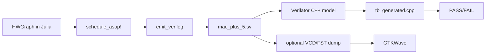

# HWExplore Usage and Examples

This guide documents the hardware generation flow: defining a computation in Julia, generating pipelined RTL, and simulating it with Verilator.

## 1. Prerequisites

- Julia 1.9+
- Verilator (5.x recommended)
- C++ compiler (`clang++` or `g++`)
- `make`
- GTKWave (optional, for waveform viewing)

Quick checks:
```bash
julia --version
verilator --version
make --version
```

## 2. Typical Iteration Loop

For each new computation you want to accelerate:

1. Define the dataflow graph nodes in Julia (via macro or `HWGraph` directly)
2. Run the scheduler (`schedule_asap!`)
3. Emit RTL (`emit_verilog`)
4. Build with Verilator
5. Run testbench and check expected result
6. Inspect waveforms if timing/handshake debugging is needed

## 3. Flow Overview



## 4. Step-by-Step Example (`mac_plus_5`)

### Step A: Build and schedule graph in Julia

The sample graph in `tests/test_dfg.jl` or `examples/run_pipeline.jl` computes:

- `node_4 = rs1 * rs2`
- `node_5 = node_4 + 5`
- return `node_5`

Run the end-to-end Julia script (this also emits RTL):

```bash
cd /path/to/HWExplore
julia --project=. examples/run_pipeline.jl
```

Expected output includes:
- `[HWExplore] Synthesized 'mac_plus_5'`
- `Emitting Verilog to .../hw/rtl/generated/mac_plus_5.sv`

### Step B: Compile generated RTL with Verilator (datapath TB)

Build and link the datapath testbench:

```bash
cd /path/to/HWExplore/hw/tb_veril
verilator --cc ../rtl/generated/mac_plus_5.sv \
  --exe tb_generated.cpp \
  --top-module mac_plus_5
make -C obj_dir -f Vmac_plus_5.mk Vmac_plus_5
```

Run simulation:

```bash
./obj_dir/Vmac_plus_5
```

Expected output:
- `done_o asserted`
- `rd_o = 17  (expected 17)`
- `TEST PASSED`

### Step C: Run CV-X-IF shell testbench

For shell-level testing (integration with the CV-X-IF protocol), use a fresh output directory (`--Mdir`) to avoid stale artifacts:

```bash
cd /path/to/HWExplore/hw/rtl
verilator --cc cvxif_hwx_shell.sv generated/mac_plus_5.sv \
  --exe tb_cvxif.cpp \
  --top-module cvxif_hwx_shell \
  --Mdir obj_dir_local \
  -I../ext_xheep/hw/vendor/openhwgroup/cv32e40x/rtl/include
make -C obj_dir_local -f Vcvxif_hwx_shell.mk Vcvxif_hwx_shell
./obj_dir_local/Vcvxif_hwx_shell
```

Expected output ends with:
- `Test 1: PASS`
- `Shell back in IDLE after kill: PASS`
- `ALL TESTS PASSED`

## 5. Optional: Waveforms with GTKWave

1. Rebuild with tracing enabled:

```bash
cd /path/to/HWExplore/hw/tb_veril
verilator --cc ../rtl/generated/mac_plus_5.sv \
  --exe tb_generated.cpp \
  --top-module mac_plus_5 \
  --trace --Mdir obj_dir_trace
make -C obj_dir_trace -f Vmac_plus_5.mk Vmac_plus_5
```

2. Add VCD dump calls in the testbench (`tb_generated.cpp`) using `VerilatedVcdC`:
- Include `verilated_vcd_c.h`
- Call `Verilated::traceEverOn(true);`
- Call `dut->trace(tfp, 99);`
- Call `tfp->open("wave.vcd");`
- Call `tfp->dump(sim_time);` each half-cycle or cycle
- Close file at end with `tfp->close();`

3. Open waveform:
```bash
gtkwave wave.vcd
```

Signals to inspect:
- `clk_i`, `rst_ni`, `start_i`
- `rs1_i`, `rs2_i`, `rd_o`
- `done_o`
- Pipeline internals: `n4_comb`, `n4_r2`, `done_shift`

## 6. Worked Example: A "Bit Complex" One, 4-Element Vector Dot Product

`mac_plus_5` above is genuinely the simplest possible case: one multiply, one add. This section walks through something with real instruction-level parallelism for the scheduler to exploit, `examples/vector_dot4.jl`, computing `dot4(a, b) = a0*b0 + a1*b1 + a2*b2 + a3*b3`, end to end, exactly as it was actually run to write this section.

### Step A: Write it as plain Julia

```julia
function dot4(a0::Int32, a1::Int32, a2::Int32, a3::Int32,
              b0::Int32, b1::Int32, b2::Int32, b3::Int32)
    p0 = a0 * b0
    p1 = a1 * b1
    p2 = a2 * b2
    p3 = a3 * b3
    (p0 + p1) + (p2 + p3)
end
```

That's the entire "hardware description." No pipeline stages, no register allocation, no port list, just the computation, written the way you'd write it to run on a CPU. This is the "how easy is it to use" answer: the effort to describe this accelerator is the effort to write eight lines of ordinary Julia.

### Step B: Run it

```bash
julia --project=. examples/vector_dot4.jl
```

Actual output:
```text
Synthesizing dot4 to DFG...
[HWExplore] Synthesized 'vector_dot4' → 16 DFG nodes, 8 inputs, 1 outputs
Scheduling ASAP...
  node 9 (OP_MUL) -> start cycle 2, finish cycle 3
  node 10 (OP_MUL) -> start cycle 2, finish cycle 3
  node 11 (OP_MUL) -> start cycle 2, finish cycle 3
  node 12 (OP_MUL) -> start cycle 2, finish cycle 3
  node 13 (OP_ADD) -> start cycle 4, finish cycle 4
  node 14 (OP_ADD) -> start cycle 4, finish cycle 4
  node 15 (OP_ADD) -> start cycle 5, finish cycle 5
Emitting Verilog to .../hw/rtl/generated/vector_dot4.sv...
Emitted: .../hw/rtl/generated/vector_dot4.sv  (latency = 5 cycle(s))
Done! Total latency: 5 cycle(s)
```

This is the scheduler doing something `mac_plus_5` never exercises: it noticed all four multiplies (`p0`..`p3`) are mutually independent and scheduled all four to **start in the same cycle** (cycle 2), then built a balanced two-level reduction tree for the adds (`p0+p1` and `p2+p3` both at cycle 4, the final combine at cycle 5) rather than a serial chain of four adds. Nobody asked for that, `schedule_asap!` derives it purely from the DFG's dependency structure.

### Step C: Look at the output

The emitted `hw/rtl/generated/vector_dot4.sv` has 8 input ports (`rs1_i`..`rs8_i`) instead of the usual `rs1_i`/`rs2_i`, the emitter supports up to 8 scalar operands per datapath (`port_names` in `src/HWGen/VerilogEmitter.jl`), one per `OP_ARG` node in the graph. **This is a real, worth-understanding limit, not an oversight**: a single CV-X-IF R-type custom instruction only ever carries two register operands (`rs1`, `rs2`), `cvxif_hwx_shell.sv` and `hwx_mux.sv` only ever forward two operands into whichever datapath is selected. An 8-operand module like this one is fully valid, fully testable RTL, but it cannot be triggered by a single custom instruction as-is. Two ways an accelerator like this *would* become CV-X-IF-pluggable, for future reference:
- **Pack operands into two 32-bit words**, the way the hand-written `hwx_simd_mac` primitive already does (four signed 8-bit lanes packed into each of `rs1`/`rs2`), trades operand width for operand count.
- **Use the stateful multi-write command pattern** the Montgomery primitive uses (`CMD_WRITE_ADDR`/`CMD_WRITE_DATA` to load operands into a local register file across several instructions, then `CMD_START`), trades instruction count for operand count.

Either is a real follow-up exercise; this example stops at "correct, pipelined RTL, tested standalone" deliberately, to isolate the Julia→RTL story from the separate CV-X-IF-operand-packing story.

### Step D: Test it with Verilator

Because it's an 8-input module, it needs its own small testbench rather than reusing `tb_generated.cpp` (which assumes exactly `rs1_i`/`rs2_i`), `hw/tb_veril/tb_vector_dot4.cpp`, following the same pattern (drive inputs, pulse `start_i`, poll `done_o`, check `rd_o`), just with 8 driven inputs and 5 test vectors instead of 1 (including a negative-value case and a back-to-back-issue case, to check the pipeline drains and restarts correctly rather than only ever being tested cold):

```bash
cd hw/tb_veril
make test_vector_dot4
```

Actual output:
```text
Vector dot4 tests: dot4(a,b) = a0*b0 + a1*b1 + a2*b2 + a3*b3
  [PASS] dot4 = 70  (expected 70)
  [PASS] dot4 = 0  (expected 0)
  [PASS] dot4 = 4  (expected 4)
  [PASS] dot4 = 2  (expected 2)
  [PASS] dot4 = 24  (expected 24)
ALL VECTOR DOT4 TESTS PASSED
```

`70 = 1·5 + 2·6 + 3·7 + 4·8`, computed by real pipelined hardware, generated from eight lines of Julia, verified against hand-computed expected values in a C++ testbench. That's the complete loop this project is for.

## 7. Suggested Contribution Pattern

When making changes to the project:
1. Keep the high-level pipeline intact: graph -> schedule -> emit -> simulate.
2. Prefer small, testable changes in the generator and RTL logic.
3. Update documentation when behavior or workflow changes.
4. Keep generated artifacts out of version control by relying on the repository ignore rules.
